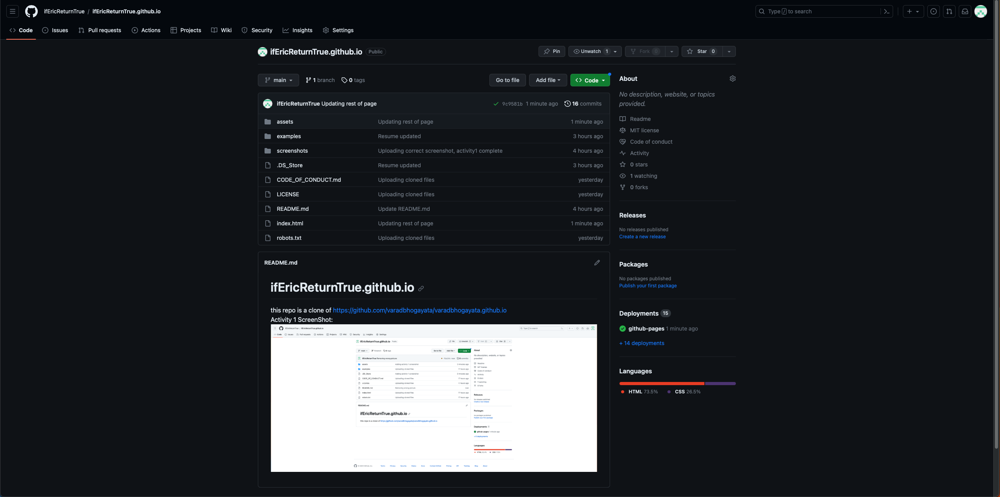
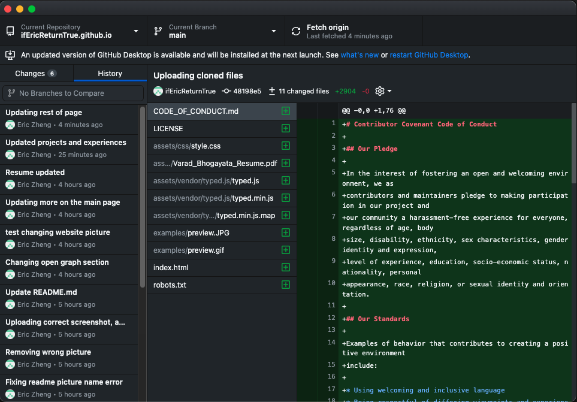
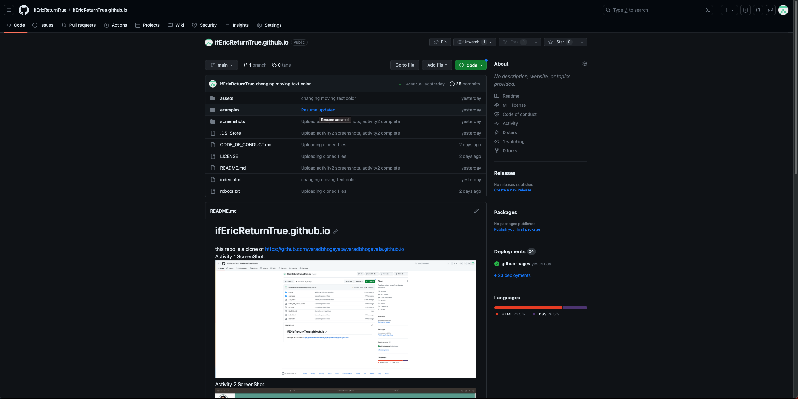
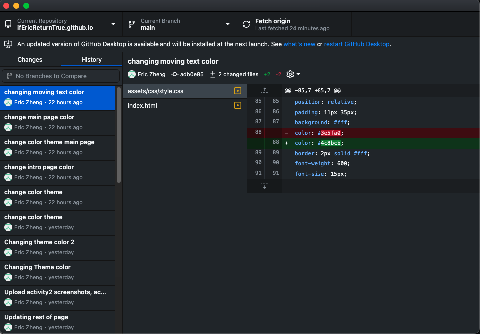
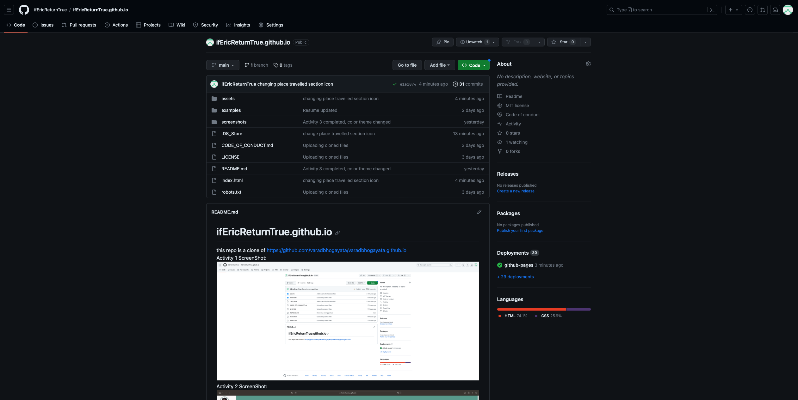
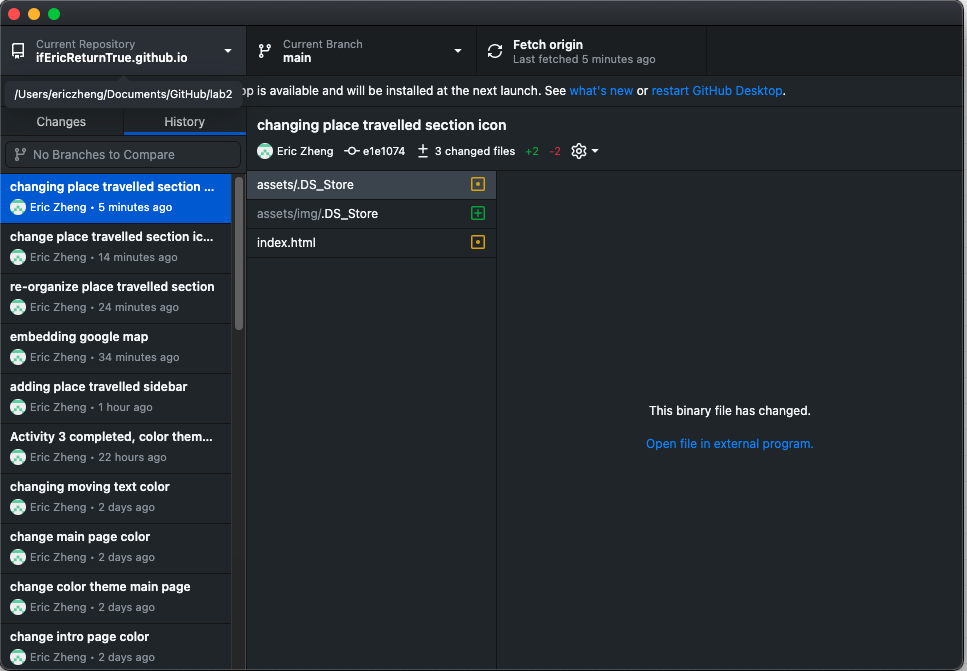

# ifEricReturnTrue.github.io   
this repo is a clone of https://github.com/varadbhogayata/varadbhogayata.github.io   
Activity 1 ScreenShot:   
   
Activity 2 ScreenShot:   
   
   
   
Activity 3 ScreenShot:   
   
   
   
Activity 4 ScreenShot:   
   
   
   
